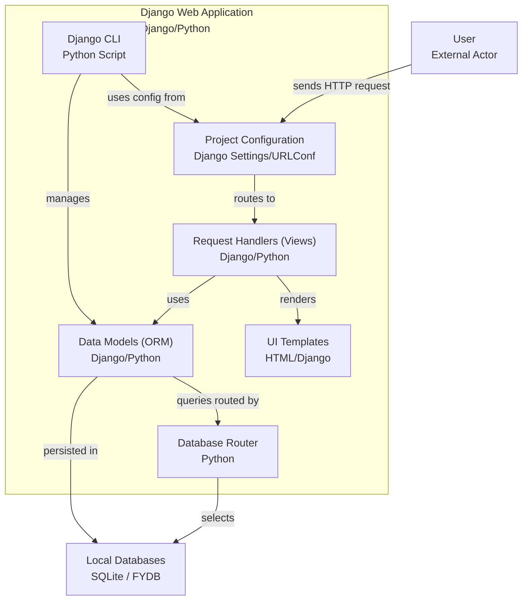

# Bluecoins Web - Django

A Django-based web application for viewing and analyzing financial transactions from [Bluecoins](https://www.bluecoinsapp.com/) mobile app backup files. Deployed with a dual-database architecture to separate Django admin and Bluecoins data, providing a responsive and user-friendly interface for financial data visualization.


---

## 🚀 Live Demo

🌐 **Try the application in action!**

👉 [<kbd>Go to the online instance</kbd>](http://3.143.0.167/)

> Click the link to explore the deployed instance and see how Bluecoins Web works in real time.

---

## Project Overview

Bluecoins Web Project is a financial data visualization and reporting tool that connects to Bluecoins backup database files (.fydb format) and provides a web interface for viewing transactions, generating reports, and analyzing financial data. The application automatically detects and connects to the most recent Bluecoins backup file, making it seamless to work with updated financial data. This project is built using Django, leveraging its powerful ORM capabilities to handle financial data efficiently, and this project is deploy on aws ec2 instance.


### 🔑 Key Features

- **Transaction Management**: View, filter, and search through financial transactions
- **Label-based Filtering**: Filter transactions by custom labels
- **Excel Report Generation**: Export filtered transaction data to Excel files with monthly sheets
- **Category-based Reports**: Analyze spending by categories
- **Responsive Web Interface**: Mobile-friendly design with modern UI
- **Automatic Database Detection**: Dynamically connects to the most recent Bluecoins backup file
- **Dual Database Architecture**: Separate databases for Django admin and Bluecoins data

💻 Tech Stack: Django, SQLite, JavaScript (ES6+), HTML5/CSS3, Excel export, AWS EC2 deployment

Production-deployed with Nginx/Gunicorn, demonstrating complete full-stack development capabilities from data modeling to cloud implementation.

## System Requirements

### Dependencies

- **Python**: 3.8+
- **Django**: 5.1.5
- **Database**: SQLite3 (built-in with Python)

### Python Packages

```txt
Django==5.1.5
openpyxl>=3.0.0  # For Excel report generation
python-dotenv>=0.19.0
```

### External Requirements

- Bluecoins mobile app backup files (.fydb format)
- Access to the backup file location (local or cloud storage)

## Installation on AWS EC2 Instance

Go to documentation for deployment on AWS EC2 instance:
 >[deploy/README_DEPLOYMENT.md](https://github.com/JuliansCastro/BluecoinsWeb/blob/main/deploy/README_DEPLOYMENT.md)

## Installation on Local Machine

If you want to run on local, you can extract separately the zip file [_**`docs/BluecoinsWeb_local_config.zip`**_](https://github.com/JuliansCastro/BluecoinsWeb/raw/refs/heads/main/docs/BluecoinsWeb_local_config.zip) and following the instructions in this README.md file.

### 1. Download the Project with PowerShell and extract the files:

```powershell
Start-Process "https://github.com/JuliansCastro/BluecoinsWeb/raw/refs/heads/main/docs/BluecoinsWeb_local_config.zip"
```

```powershell
Expand-Archive -Path "BluecoinsWeb_local_config.zip" -DestinationPath "BluecoinsWeb"
```

```powershell
Remove-Item "BluecoinsWeb_local_config.zip"
```

```powershell
cd BluecoinsWeb
```


### 2. Create Virtual Environment (Recommended)

```bash
python -m venv venv

# On Windows
venv\Scripts\activate

# On macOS/Linux
source venv/bin/activate
```

### 3. Install Dependencies

```bash
pip install -r requirements.txt
```

or

```bash
pip install Django==5.1.5 openpyxl python-dotenv>=0.19.0
```

### 4. Database Configuration

#### Configure Bluecoins Database Path

Edit `BluecoinsWeb_project/settings.py` and update the `find_bluecoins_database()` function to point to your Bluecoins backup directory:

```python
def find_bluecoins_database():
    # Update this path to your Bluecoins backup directory
    bluecoins_dir = r'C:/path/to/your/Bluecoins/backup/folder/'
    # ... rest of the function
```

#### Setup Django Database

```bash
python manage.py migrate
```

### 5. Create Superuser (Optional)

```bash
python manage.py createsuperuser
```

### 6. Run Development Server

```bash
python manage.py runserver
```

The application will be available at `http://127.0.0.1:8000/`

## Usage

### Basic Navigation

1. **Home Page** (`/`): Welcome page with navigation links
2. **Transactions List** (`/transactions/`): View all transactions with filtering options
3. **Transaction Details** (`/transactions/<id>/`): View individual transaction details
4. **Reports**: Generate Excel reports filtered by labels or categories

### Key Endpoints

| Endpoint | Description | Methods |
|----------|-------------|---------|
| `/` | Home page | GET |
| `/transactions/` | List all transactions with pagination | GET |
| `/transactions/<id>/` | Transaction detail view | GET |
| `/transactions/new/` | Create new transaction | GET, POST |
| `/transactions/<id>/edit/` | Edit transaction | GET, POST |
| `/transactions/<id>/delete/` | Delete transaction | GET, POST |
| `/reports_by_category/` | Category-based report | GET |
| `/reports_by_label/` | Excel report by label | GET |

### Filtering Transactions

#### By Label

```url
/transactions/?label=<label_name>
```

#### Pagination

The application automatically handles pagination with AJAX loading for smooth user experience.

### Generating Reports

#### Excel Reports by Label

```url
/reports_by_label/?label=<label_name>
```

This generates an Excel file with transactions grouped by month in separate sheets.

#### Category Reports

```url
/reports_by_category/
```

Displays spending analysis grouped by transaction categories.

## Project Structure

```text
BluecoinsWeb_project/
├── manage.py                     # Django management script
├── README.md                     # Project documentation
├── BluecoinsWeb_project/         # Main project configuration
│   ├── __init__.py
│   ├── settings.py               # Django settings with dual database setup
│   ├── urls.py                   # URL routing configuration
│   ├── wsgi.py                   # WSGI configuration
│   └── asgi.py                   # ASGI configuration
├── BluecoinsWeb_app/                # Main application
│   ├── __init__.py
│   ├── models.py                 # Database models (auto-generated from Bluecoins schema)
│   ├── views.py                  # View controllers and business logic
│   ├── urls.py                   # App-specific URL patterns
│   ├── dbrouters.py              # Database routing configuration
│   ├── admin.py                  # Django admin configuration
│   ├── apps.py                   # App configuration
│   ├── tests.py                  # Test cases
│   ├── migrations/               # Database migrations
│   ├── static/                   # Static files (CSS, JS, images)
│   │   └── images/
│   │       ├── cropped-favico-192x192.png
│   │       └── cropped-favico-32x32.png
│   └── templates/                # HTML templates
│       ├── home.html
│       ├── transactions_list.html
│       ├── transactions_partial.html
│       ├── transaction_detail.html
│       ├── transaction_form.html
│       ├── transaction_confirm_delete.html
│       ├── report_by_category.html
│       └── no_transactions_report.html
└── databases/                    # Database files
    ├── bluecoins_admin.db        # Django admin database
    └── bluecoins.fydb            # Bluecoins backup file (example)
```

## App Diagram



## Testing

### Running Tests

```bash
python manage.py test
```

### Manual Testing

1. **Database Connection**: Verify the application connects to your Bluecoins backup file
2. **Transaction Loading**: Check that transactions display correctly with pagination
3. **Filtering**: Test label-based filtering functionality
4. **Report Generation**: Generate Excel reports and verify data accuracy
5. **Responsive Design**: Test the interface on different screen sizes

### Sample Test Scenarios

1. **Filter by Label**: `/transactions/?label=groceries`
2. **Generate Report**: `/reports_by_label/?label=transportation`
3. **Category Analysis**: `/reports_by_category/`

## Configuration

### Database Settings

The application uses a dual-database setup:

1. **Default Database** (`bluecoins_admin.db`): For Django admin, user management, and app metadata
2. **Bluecoins Database** (`.fydb` files): Read-only access to Bluecoins financial data

### Dynamic Database Detection

The `find_bluecoins_database()` function automatically:

- Searches for `bluecoins*.fydb` files in the specified directory
- Selects the most recently modified file
- Provides fallback to a local database if no files are found

### Customization Options

1. **Pagination**: Modify `paginate_by` in `TransactionsListView` (default: 50)
2. **Currency Display**: Amounts are automatically converted from micro-units
3. **Date Formatting**: Localized date formatting (currently set to Spanish)
4. **Report Structure**: Customize Excel report columns in `report_by_label_excel()`

## Architecture

### Database Models

The application includes auto-generated Django models based on the Bluecoins database schema:

- **Transactions_table**: Core transaction data
- **Labels_table**: Transaction labeling system
- **Accounts_table**: Financial accounts
- **Child_category_table**: Transaction categories
- **Item_table**: Transaction items/descriptions
- **Transaction_type_table**: Types of transactions

### Database Router

The `BluecoinsDBRouter` ensures:

- Bluecoins app models use the Bluecoins database
- Django admin models use the default database
- Proper isolation between databases

### View Architecture

- **Class-based Views**: For CRUD operations
- **Function-based Views**: For reports and custom functionality
- **AJAX Support**: For pagination and dynamic content loading

## Troubleshooting

### Common Issues

1. **Database Not Found**
   - Verify the path in `find_bluecoins_database()`
   - Ensure backup files have `.fydb` extension
   - Check file permissions

2. **No Transactions Displayed**
   - Verify database connection
   - Check if `TRANSACTIONSTABLE` exists in the backup file
   - Ensure proper database routing

3. **Excel Export Fails**
   - Install `openpyxl`: `pip install openpyxl`
   - Check file permissions for download directory

4. **Static Files Not Loading**
   - Run `python manage.py collectstatic` in production
   - Verify `STATIC_URL` configuration

### Debug Mode

For development, ensure `DEBUG = True` in `settings.py`. For production, set `DEBUG = False` and configure `ALLOWED_HOSTS`.

## Contributing

### Development Setup

1. Fork the repository
2. Create a feature branch
3. Make changes with appropriate tests
4. Ensure code follows Django best practices
5. Submit a pull request

### Code Style

- Follow PEP 8 for Python code
- Use Django naming conventions
- Include docstrings for complex functions
- Maintain responsive design principles

## License

This project is licensed under the MIT License. See the LICENSE file for details.

## Support

For issues and questions:

1. Check the troubleshooting section
2. Review Django documentation for framework-specific issues
3. Examine Bluecoins backup file format if data issues occur

## Production Configuration

### Environment Variables Setup

For production deployment, configure the following environment variables to keep sensitive data secure:

#### 1. Create Environment File

Copy the example environment file and configure your settings:

```bash
cp .env.example .env
```

#### 2. Configure Environment Variables

Edit the `.env` file with your production settings:

```bash
# Generate a new secret key for production
# You can generate one with: python -c 'from django.core.management.utils import get_random_secret_key; print(get_random_secret_key())'
DJANGO_SECRET_KEY=your-super-secret-key-here

# Set to 'false' for production, 'true' only for development
DJANGO_DEBUG=false

# Add your domain or IP addresses for production (comma-separated)
DJANGO_ALLOWED_HOSTS=yourdomain.com,127.0.0.1,localhost
```

#### 3. Generate Secure Secret Key

```bash
python -c "from django.core.management.utils import get_random_secret_key; print(get_random_secret_key())"
```

Copy the generated key and update the `DJANGO_SECRET_KEY` in your `.env` file.

#### 4. Security Considerations

- **Never commit** the `.env` file to version control
- Use different secret keys for development and production
- Set `DJANGO_DEBUG=false` in production
- Configure proper `ALLOWED_HOSTS` for your domain
- Ensure `.env` is listed in `.gitignore`

#### 5. Only for test this app (No secure)

Login in the admin Django interface (For example, http://127.0.0.1:8000/admin/) with the following credentials:

```plaintext
Username: admin
Password: {oMYREY848i4
```

### Dependencies for Production

Install the additional dependencies required for environment variable management:

```bash
pip install -r requirements.txt
```

The `requirements.txt` now includes:
- `Django==5.1.5`
- `openpyxl>=3.0.0` (for Excel exports)
- `python-dotenv>=0.19.0` (for environment variables)

---

**Last Updated**: June 2025  
**Django Version**: 5.1.5  
**Python Version**: 3.8+
